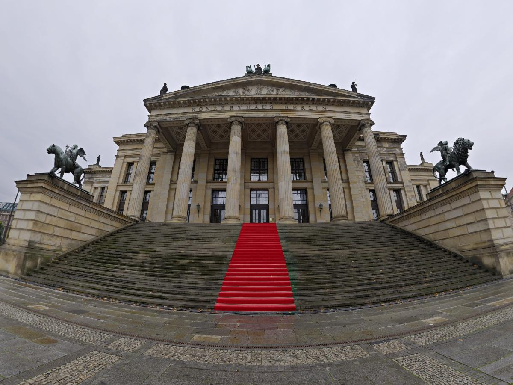

# Spherical Distortion

Lens distortion using the spherical distortion model

## Setup
```
pip install git+https://github.com/dompm/spherical_distortion.git
```

## Usage
```
from sphericaldistortion import crop_panorama, distort, undistort
```

### Crop from a 360 panorama

```
crop = crop_panorama('data/quattro_canti.jpg', # panorama or path to panorama
                     H=900, # height of the cropped image
                     W=1200, # width of the cropped image
                     f=1000, # focal length in pixels
                     xi=0.5, # distortion parameter
                     az=0, # azimuth of the camera in radians
                     el=-0.25, # elevation of the camera in radians
                     roll=0 # roll of the camera in radians
                     )
```

|Pano | Result|
|-|-|
|||

### Apply distortion

```
distorted_image = distort('data/straight_crop.jpg', # image or path to image
                          f=320, # focal length in pixels
                          xi=0.75 # distortion parameter
                          )
```

|Input | Result|
|-|-|
|||

### Undistort image

```
undistorted_image = undistort('data/distorted_crop.jpg', # image or path to image
                              f=830, # focal lenght in pixels
                              xi=0.75 # distortion parameter
                              )
```

|Input | Result|
|-|-|
|||
